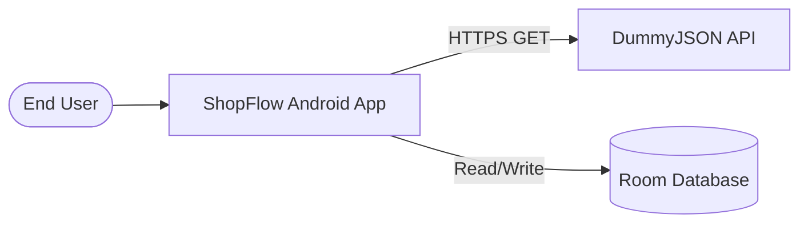

# ShopFlow — Master Software Requirements Specification

**Document ID**: SRS-SHOPFLOW-001  
**Version**: 1.0-DRAFT  
**Date**: 2026-08-27  
**Status**: DRAFT — PENDING HUMAN APPROVAL

---

## 1. Purpose

This document defines the complete software requirements for ShopFlow, an Android application that provides an offline-first product catalog browsing experience with search, category filtering, and favorites management. It serves as the authoritative requirements reference for all development agents and human reviewers.

## 2. Scope

### 2.1 In Scope

- Product catalog browsing with paginated loading
- Product search with debounced queries
- Category-based product filtering
- Product detail view with full product information
- Favorites management (local, device-only)
- Offline-first data architecture (Room as source of truth)
- Material 3 design system with dark mode and dynamic color
- Adaptive layouts for phones, tablets, and foldables
- Accessibility compliance

### 2.2 Out of Scope

- User authentication / login
- Shopping cart / checkout / payments
- User accounts / profiles
- Push notifications
- Product reviews submission
- Admin / CMS functionality
- Multi-device favorites sync
- Analytics / tracking
- Localization / i18n beyond English
- Wear OS / TV / Auto support

## 3. Stakeholders

| Role | Description |
|------|-------------|
| Product Owner | Defines requirements and approves scope |
| Developer (AI Agent) | Implements requirements per approved plan |
| Reviewer (Human) | Reviews and approves architecture, plan, implementation |
| End User | Uses the app to browse and discover products |

## 4. User Classes

| Class | Description | Priority |
|-------|-------------|----------|
| Casual Browser | Opens app to explore products; expects smooth scrolling and appealing UI | Primary |
| Targeted Searcher | Has a specific product or category in mind; uses search and filters | Primary |
| Wishlist User | Saves interesting products to favorites for later reference | Secondary |
| Offline User | Uses app in areas with poor/no connectivity; expects cached data | Secondary |

## 5. Product Perspective

ShopFlow is a standalone Android application. It consumes the public [DummyJSON Products API](https://dummyjson.com/) as its data source. Data is cached locally in a Room database. The app does not require authentication and does not modify server-side data.

### 5.1 System Context

## 6. Assumptions

- A-001: DummyJSON API remains publicly available and free
- A-002: API response schema remains stable (verified 2026-08-27)
- A-003: Total products count is ~194 (small dataset)
- A-004: API pagination uses `limit` + `skip` parameters
- A-005: No authentication is required for product endpoints
- A-006: Device has sufficient storage for product cache (~5MB max)

## 7. Constraints

- C-001: Android only (no iOS, web, or desktop)
- C-002: minSdk 24 (Android 7.0)
- C-003: Single-module app (no multi-module initially)
- C-004: English only
- C-005: Read-only API usage (GET endpoints only)
- C-006: 16 KB page-size compatibility required for modern devices
- C-007: Must work offline with previously cached data

---

## 8. Functional Requirements

### 8.1 Product Catalog (FR-100 series)

| ID | Requirement | Priority | Acceptance Criteria |
|----|-------------|----------|-------------------|
| FR-101 | The app shall display a scrollable list of products | Must | Product list renders with title, thumbnail, price, rating |
| FR-102 | The product list shall load data using pagination | Must | Scrolling beyond visible items triggers loading of next page |
| FR-103 | Each product card shall display: thumbnail, title, price, discount, rating, brand | Must | All listed fields visible on each card |
| FR-104 | Products shall be loaded from the network and cached in Room | Must | First load populates Room; subsequent loads read from Room |
| FR-105 | Paginated loading shall use RemoteMediator pattern | Must | RemoteMediator handles REFRESH, APPEND correctly |
| FR-106 | Pull-to-refresh shall reload data from the network | Should | Pull gesture triggers full refresh |
| FR-107 | The list shall show loading indicators during data fetch | Must | Spinner/shimmer visible during initial load and page append |

### 8.2 Product Search (FR-200 series)

| ID | Requirement | Priority | Acceptance Criteria |
|----|-------------|----------|-------------------|
| FR-201 | The app shall provide a search bar for product search | Must | Search bar is visible and accessible on product list screen |
| FR-202 | Search shall query the DummyJSON search endpoint | Must | Typing a query triggers API search with `?q=` parameter |
| FR-203 | Search input shall be debounced (300ms minimum) | Must | Rapid typing does not trigger a request per keystroke |
| FR-204 | Search results shall be displayed in the same list format | Must | Search results use the same product card layout |
| FR-205 | Empty search query shall return to the full product catalog | Must | Clearing search shows the default paginated catalog |
| FR-206 | Search shall show "no results" state when appropriate | Must | Empty result set shows informative empty state |
| FR-207 | Search shall be cancellable | Should | User can dismiss search and return to catalog |

### 8.3 Category Filtering (FR-300 series)

| ID | Requirement | Priority | Acceptance Criteria |
|----|-------------|----------|-------------------|
| FR-301 | The app shall fetch and display product categories | Must | Category list is retrieved from API and displayed |
| FR-302 | Users shall filter products by selecting a category | Must | Selecting a category shows only products in that category |
| FR-303 | An "All" option shall clear the category filter | Must | Selecting "All" returns to the full catalog |
| FR-304 | Category filter and search shall be mutually exclusive or composable | TBD | TBD — REQUIRES DECISION on interaction model |

### 8.4 Product Detail (FR-400 series)

| ID | Requirement | Priority | Acceptance Criteria |
|----|-------------|----------|-------------------|
| FR-401 | Tapping a product shall navigate to a detail screen | Must | Navigation occurs on tap; back returns to list |
| FR-402 | Detail screen shall display all product information | Must | Title, images, description, price, discount, rating, brand, category, stock, tags, dimensions, warranty, shipping, return policy, reviews, availability |
| FR-403 | Detail screen shall display product images in a scrollable gallery | Should | Multiple images are scrollable/swipeable |
| FR-404 | Detail screen shall show product reviews | Should | Reviews section with reviewer name, rating, comment |
| FR-405 | Detail screen shall show a favorites toggle | Must | Heart/bookmark icon toggles favorite state |

### 8.5 Favorites (FR-500 series)

| ID | Requirement | Priority | Acceptance Criteria |
|----|-------------|----------|-------------------|
| FR-501 | Users shall toggle a product as favorite | Must | Tapping favorite icon adds/removes from favorites |
| FR-502 | Favorites shall be persisted locally in Room | Must | Favorites survive app restart |
| FR-503 | A dedicated favorites screen shall show all favorited products | Must | Screen lists all favorites with same card format |
| FR-504 | Favorites screen shall show empty state when no favorites exist | Must | Informative empty state displayed |
| FR-505 | Unfavoriting from favorites screen shall remove the item | Must | Item disappears from list upon unfavorite |
| FR-506 | Favorite state shall be visible on product cards in all lists | Should | Heart icon state reflects favorite status in catalog and search |

### 8.6 Navigation (FR-600 series)

| ID | Requirement | Priority | Acceptance Criteria |
|----|-------------|----------|-------------------|
| FR-601 | App shall use bottom navigation with Product List and Favorites tabs | Must | Two-tab navigation visible |
| FR-602 | Navigation shall use type-safe Navigation Compose | Must | Routes are type-safe, not string-based |
| FR-603 | Back navigation shall behave correctly across all screens | Must | System back returns to previous screen; no unexpected behavior |

---

## 9. Non-Functional Requirements

### 9.1 Performance (NFR-100 series)

| ID | Requirement | Priority | Acceptance Criteria |
|----|-------------|----------|-------------------|
| NFR-101 | Cold start shall complete within 2 seconds on mid-range device | Should | Measured from launch to first content visible |
| NFR-102 | Product list scrolling shall maintain 60fps | Must | No visible jank during scroll |
| NFR-103 | Search response shall appear within 500ms of debounce completion | Should | Measured from final keystroke + debounce to results |
| NFR-104 | Image loading shall not block UI thread | Must | Images load asynchronously with placeholder |

### 9.2 Reliability (NFR-200 series)

| ID | Requirement | Priority | Acceptance Criteria |
|----|-------------|----------|-------------------|
| NFR-201 | App shall not crash on network failure | Must | Graceful error state displayed |
| NFR-202 | App shall recover gracefully from API errors | Must | Retry available; no data corruption |
| NFR-203 | Room database operations shall not corrupt data on interruption | Must | Transactions used for multi-row operations |

### 9.3 Offline (NFR-300 series)

| ID | Requirement | Priority | Acceptance Criteria |
|----|-------------|----------|-------------------|
| NFR-301 | App shall display cached products when offline | Must | Previously loaded products visible without network |
| NFR-302 | App shall show offline indicator when network unavailable | Should | User informed of offline state |
| NFR-303 | App shall show appropriate state on first launch without network | Must | Empty/error state with retry, not a crash |
| NFR-304 | Favorites shall function fully offline | Must | Add/remove favorites works without network |

### 9.4 Accessibility (NFR-400 series)

| ID | Requirement | Priority | Acceptance Criteria |
|----|-------------|----------|-------------------|
| NFR-401 | All interactive elements shall have minimum 48dp touch targets | Must | Measurable via Compose semantics |
| NFR-402 | All images shall have content descriptions | Must | TalkBack reads meaningful descriptions |
| NFR-403 | Text shall scale with system font size preference | Must | No text clipping at 200% font scale |
| NFR-404 | Color shall not be the sole indicator of information | Must | Icons/text supplement color indicators |
| NFR-405 | Screen readers shall navigate all content logically | Must | TalkBack traversal follows visual order |

### 9.5 Security (NFR-500 series)

| ID | Requirement | Priority | Acceptance Criteria |
|----|-------------|----------|-------------------|
| NFR-501 | No sensitive data shall be logged in production | Must | Logging review shows no PII/secrets |
| NFR-502 | Network communication shall use HTTPS | Must | All API calls use HTTPS |
| NFR-503 | Debug features shall be disabled in release builds | Must | No debug panels/logging in release APK |

### 9.6 Compatibility (NFR-600 series)

| ID | Requirement | Priority | Acceptance Criteria |
|----|-------------|----------|-------------------|
| NFR-601 | App shall support Android 7.0 (API 24) through latest | Must | Runs on API 24 emulator and latest device |
| NFR-602 | App shall support 16 KB memory page-size devices | Must | APK verified for 16KB alignment |
| NFR-603 | App shall support both portrait and landscape orientations | Must | Layout adapts correctly |
| NFR-604 | App shall support dark mode | Must | Dark theme renders correctly |
| NFR-605 | App shall support dynamic color (Android 12+) | Should | Material You colors applied on supported devices |

### 9.7 Adaptive UI (NFR-700 series)

| ID | Requirement | Priority | Acceptance Criteria |
|----|-------------|----------|-------------------|
| NFR-701 | App shall adapt layout based on window size classes | Must | Compact/Medium/Expanded layouts differ appropriately |
| NFR-702 | Expanded layout shall use list-detail pattern | Should | List and detail visible simultaneously on large screens |
| NFR-703 | App shall support split-screen and foldable devices | Should | No crashes or broken layouts in multi-window |

---

## 10. Data Requirements

See `docs/03-data/DATA_MODEL.md` for detailed data model.  
See `docs/03-data/API_SPECIFICATION.md` for verified API contract.  
See `docs/03-data/ERD.md` for entity-relationship diagram.

## 11. External Interfaces

### 11.1 DummyJSON Products API

- Base URL: `https://dummyjson.com/`
- Protocol: HTTPS (REST/JSON)
- Authentication: None required
- Rate limiting: Not documented; assume reasonable use
- See `docs/03-data/API_SPECIFICATION.md` for detailed contract

## 12. Requirement Traceability

See `docs/01-requirements/TRACEABILITY_MATRIX.md` for full traceability from requirements to tests.

---

**Document Status**: DRAFT — Awaiting human review and approval.
