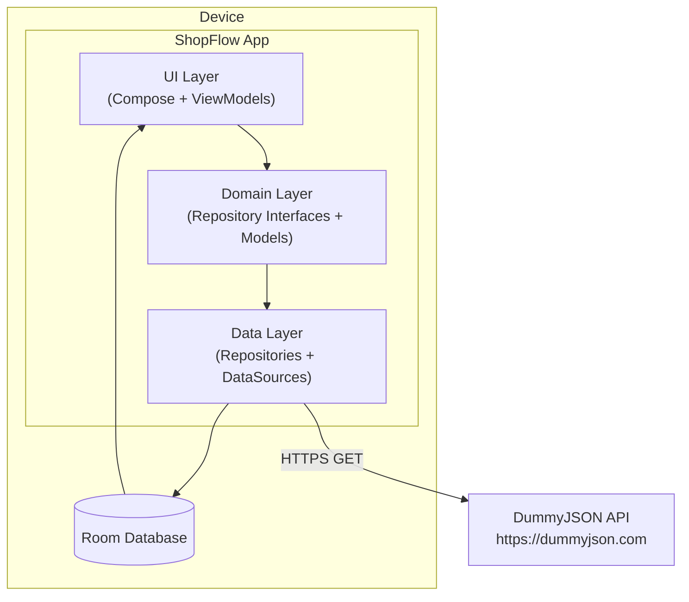
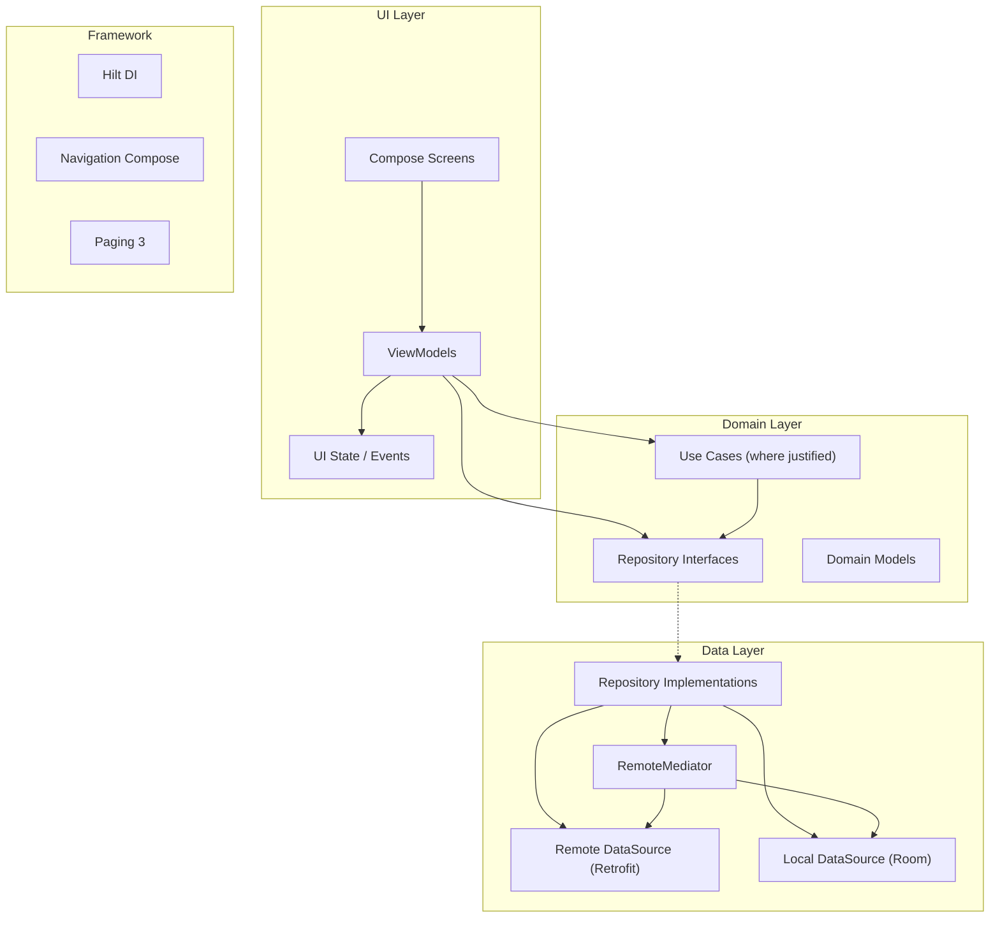
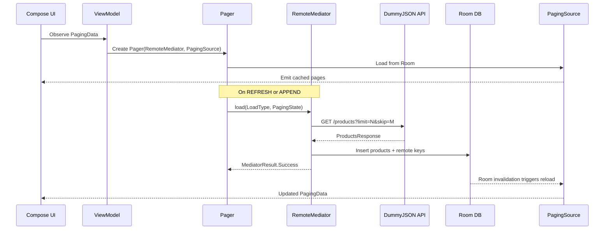
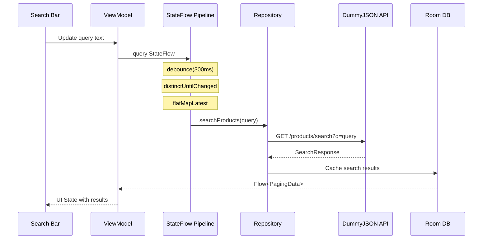
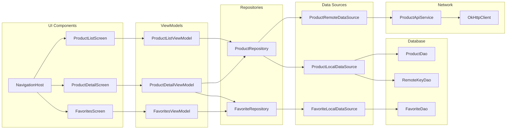
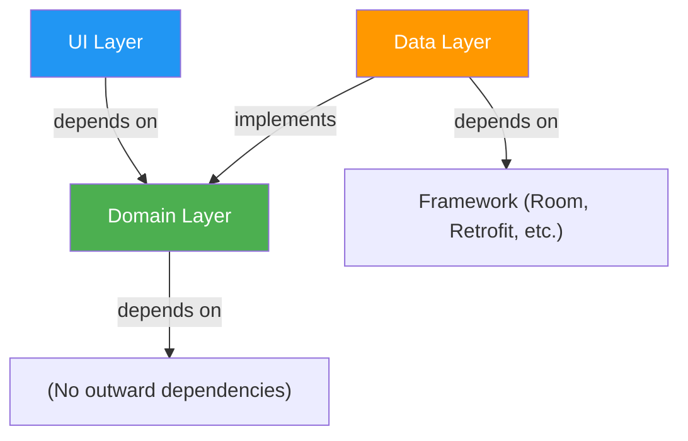

# ShopFlow — System Architecture

**Version**: 1.0-DRAFT  
**Date**: 2026-08-27  
**Status**: DRAFT — PENDING HUMAN APPROVAL

---

## 1. Overview

ShopFlow follows a layered MVVM architecture with an offline-first data strategy. Room database serves as the single source of truth for the UI. The network layer (Retrofit) feeds data into Room via RemoteMediator, and the UI observes Room through Paging 3's PagingSource and Kotlin Flows.

## 2. Stakeholders & Concerns

| Stakeholder | Concern |
|-------------|---------|
| End User | Fast loading, smooth scrolling, works offline, looks great |
| Developer | Clear architecture, testable components, maintainable code |
| Reviewer | Correct patterns, no anti-patterns, verified behavior |

## 3. System Boundary

## 4. Architecture Views

### 4.1 Layer View

### 4.2 Data Flow — Paginated Product List

### 4.3 Data Flow — Search

### 4.4 Component Diagram

### 4.5 Dependency Direction

**Key principle**: Domain layer has no dependencies on Android framework, Room, or Retrofit. It defines interfaces that the Data layer implements.

## 5. Major Components

### 5.1 UI Layer
- **Compose Screens**: Stateless composables receiving state from ViewModels
- **ViewModels**: Hold UI state as StateFlow; handle user events; delegate to repositories
- **Navigation**: Type-safe Navigation Compose with bottom navigation

### 5.2 Domain Layer
- **Repository Interfaces**: Define data contracts (not implementations)
- **Domain Models**: Pure Kotlin data classes representing business entities
- **Use Cases**: Only where they encapsulate non-trivial business logic (avoid ceremony)

### 5.3 Data Layer
- **Repository Implementations**: Coordinate between remote and local data sources
- **RemoteMediator**: Manages network → Room pipeline for Paging 3
- **Remote DataSource**: Retrofit API service for DummyJSON
- **Local DataSource**: Room DAOs for products, favorites, remote keys

## 6. Quality Attributes

| Attribute | Strategy |
|-----------|----------|
| **Testability** | Interfaces for repositories, constructor injection via Hilt, fakes for testing |
| **Offline Resilience** | Room as source of truth; UI never reads directly from network |
| **Performance** | Paging 3 for efficient loading; Coil for image caching; lazy composition |
| **Maintainability** | Clear layer boundaries; stable interfaces; documented ADRs |
| **Adaptability** | Window size classes for responsive layouts; no hardcoded breakpoints |

## 7. Key Architecture Decisions

See `docs/08-decisions/ADR-INDEX.md` for full list.

| ADR | Decision |
|-----|----------|
| ADR-001 | Room as Single Source of Truth |
| ADR-002 | RemoteMediator for Paging |
| ADR-003 | Material 3 Design Language |
| ADR-004 | Type-Safe Navigation |
| ADR-005 | Adaptive Window-Size-Based Layout |
| ADR-006 | Repository/Domain Boundary |

## 8. Trade-offs

| Trade-off | Choice | Rationale |
|-----------|--------|-----------|
| Single module vs. multi-module | Single module | Small project; multi-module adds complexity without proportional benefit |
| Use cases everywhere vs. selective | Selective | Avoid ceremonial pass-through use cases; use when business logic exists |
| Network-first vs. offline-first | Offline-first | Room as source of truth provides better UX, especially on flaky connections |
| Full Clean Architecture vs. pragmatic layers | Pragmatic | Three layers with clear boundaries; no unnecessary abstractions |

---

**Document Status**: DRAFT — Awaiting human review and approval.
