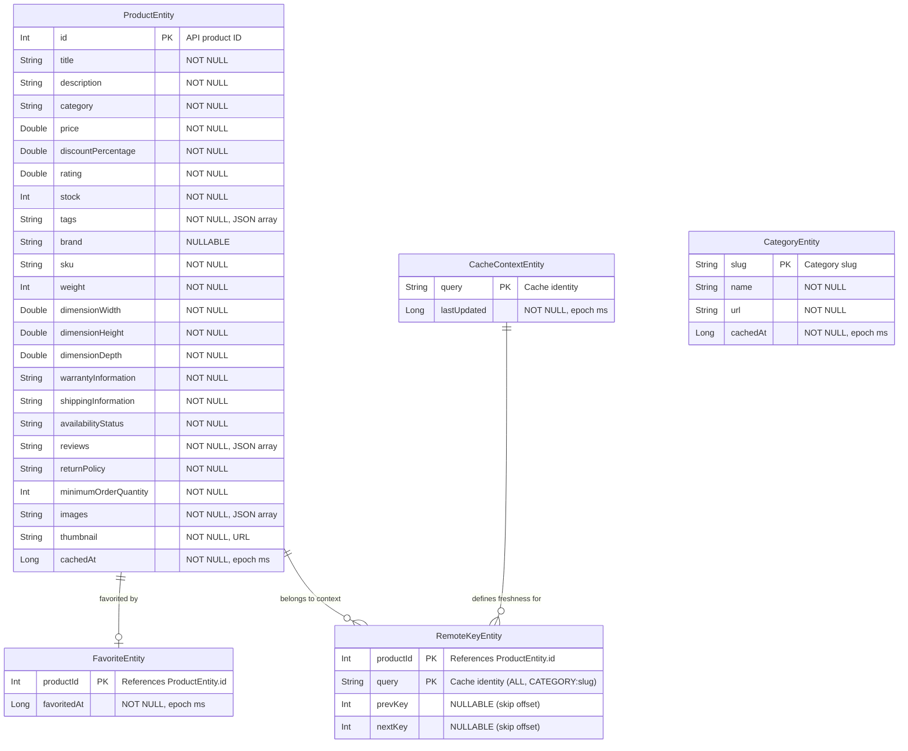

# ShopFlow — Entity Relationship Diagram
**Version**: 2.0
**Date**: 2026-08-27
**Status**: APPROVED
---
## ERD

## Relationship Notes
- **ProductEntity → FavoriteEntity**: One-to-zero-or-one. A product may or may not be favorited. FavoriteEntity uses `productId` as PK, referencing `ProductEntity.id`.
- **ProductEntity → RemoteKeyEntity**: One-to-many. A single canonical product can belong to multiple caching contexts (e.g. "ALL" and "CATEGORY:smartphones"). The `RemoteKeyEntity` maps products to contexts and stores their pagination skip offsets.
- **CacheContextEntity → RemoteKeyEntity**: One-to-many. A cache context dictates the freshness for all remote keys tied to that `query`.
- **CategoryEntity**: Independent entity. No foreign key to ProductEntity — category matching is done by string comparison on `ProductEntity.category` = `CategoryEntity.slug`.
## Index Strategy
| Table | Index | Columns | Purpose |
|-------|-------|---------|---------|
| favorites | (PK) | `productId` | Favorite lookup |
| remote_keys | (PK) | `productId, query` | Context membership & pagination |
| cache_context| (PK) | `query` | Freshness check |
