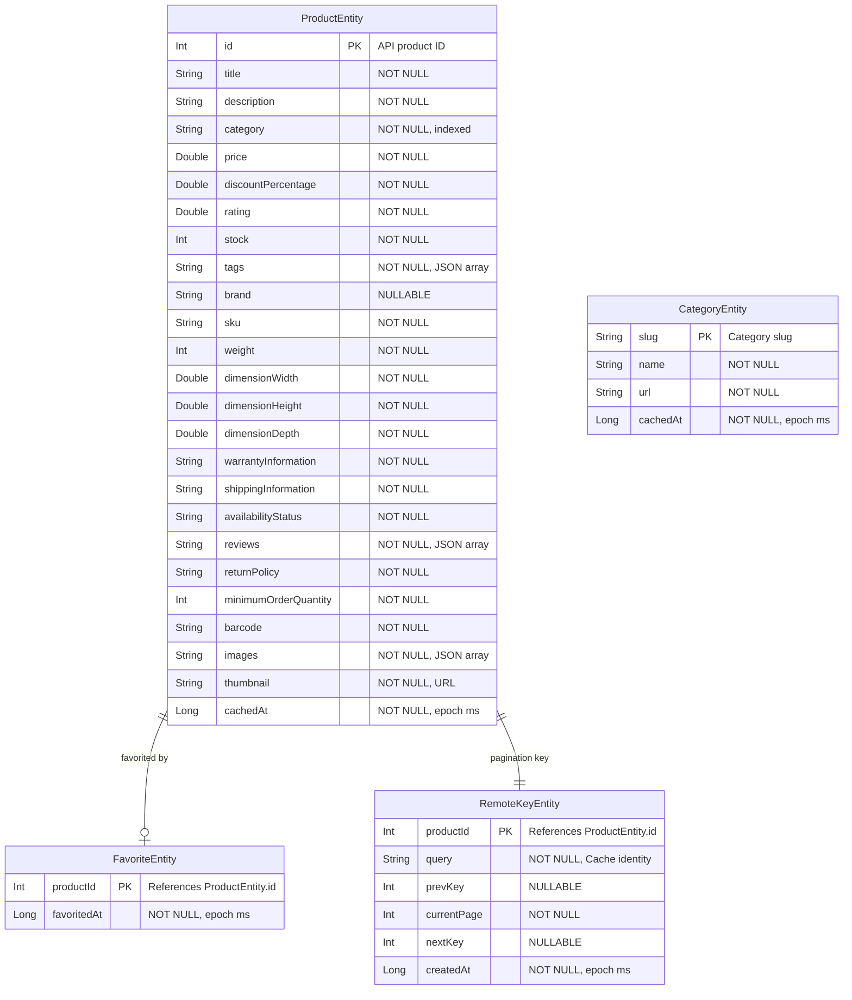

# ShopFlow — Entity Relationship Diagram

**Version**: 1.0-DRAFT  
**Date**: 2026-08-27

---

## ERD

## Relationship Notes

- **ProductEntity → FavoriteEntity**: One-to-zero-or-one. A product may or may not be favorited. FavoriteEntity uses `productId` as PK, referencing `ProductEntity.id`.
- **ProductEntity → RemoteKeyEntity**: One-to-one during pagination. Each cached product has a corresponding remote key for pagination tracking. Remote keys are cleared alongside products on REFRESH.
- **CategoryEntity**: Independent entity. No foreign key to ProductEntity — category matching is done by string comparison on `ProductEntity.category` = `CategoryEntity.slug`.

## Index Strategy

| Table | Index | Columns | Purpose |
|-------|-------|---------|---------|
| products | `index_products_category` | `category` | Category filter queries |
| products | `index_products_title` | `title` | Search optimization |
| favorites | (PK) | `productId` | Favorite lookup |
| remote_keys | (PK) | `productId` | Pagination key lookup |

---

**Document Status**: DRAFT — Awaiting human review and approval.
