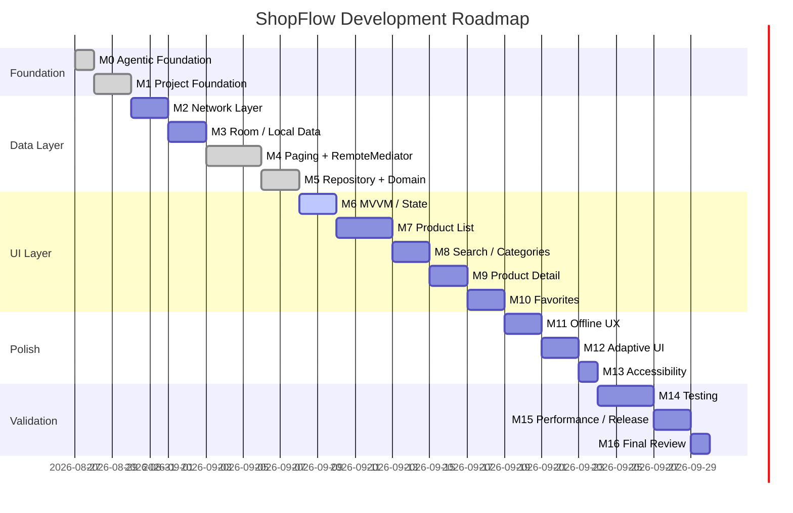

# ShopFlow — Roadmap

**Version**: 1.0
**Date**: 2026-08-27  
**Status**: APPROVED

---

## Milestones

## Milestone Details

### M0 — Agentic Development Foundation ✅ (Current)
- Establish project documentation system
- Create AI agent instructions (AGENTS.md, CLAUDE.md, .cursor/, .agents/)
- Create SRS, PRD, Architecture, ERD, API spec
- Create UI/UX specifications
- Create ADRs, roadmap, task backlog
- Create status tracking system

**Exit Criteria**: All planning documents created and reviewed.

### M1 — Project Foundation ✅ (Completed)
- Add all dependencies to Version Catalog
- Set up package structure
- Configure Hilt and KSP
- Create base Application class
- Verify build succeeds

**Dependencies**: M0 approved  
**Exit Criteria**: Project builds with all dependencies; Hilt compiles.

### M2 — Network Layer ✅ (Completed)
- Create Retrofit API service interface
- Create OkHttp client with logging interceptor
- Create API response DTOs
- Create Hilt network module
- Write API service unit tests

**Dependencies**: M1  
**Exit Criteria**: API service interface defined; DTOs match verified API schema.

### M3 — Room / Local Data ✅ (Completed)
- Create Room entities (ProductEntity, FavoriteEntity, RemoteKeyEntity)
- Create DAOs
- Create TypeConverters
- Create database class
- Create Hilt database module
- Write DAO unit tests
- Implement Context-Aware Cache Schema

**Dependencies**: M1  
**Exit Criteria**: Database compiles; DAO tests pass with in-memory database.

### M4 — Paging + RemoteMediator ✅ (Completed)
- Create RemoteMediator implementation
- Create PagingSource configuration
- Create Pager setup
- Handle REFRESH, APPEND, PREPEND
- Remote key management
- Write RemoteMediator unit tests

**Dependencies**: M2, M3  
**Exit Criteria**: Paging pipeline fetches from API, inserts into Room, emits PagingData.

### M5 — Repository + Domain ✅ (Completed)
- Create domain models
- Create repository interfaces
- Create repository implementations
- Create mapper functions (DTO → Entity → Domain)
- Create Hilt repository module
- Write repository unit tests

**Dependencies**: M4  
**Exit Criteria**: Repository provides paginated products, search, categories, favorites.

### M6 — MVVM / State Management (Current)
- Create ViewModels
- Define UI state classes
- Define UI events
- Connect ViewModels to repositories
- Write ViewModel unit tests

**Dependencies**: M5  
**Exit Criteria**: ViewModels expose observable state; tests verify state transitions.

### M7 — Product List Screen
- Create product card composable
- Create product list screen
- Connect to ViewModel/PagingData
- Implement loading, error, empty states
- Implement pull-to-refresh
- Bottom navigation shell

**Dependencies**: M6  
**Exit Criteria**: Product list renders with pagination; all states display.

### M8 — Search / Categories
- Create search bar UI
- Implement search with debounce pipeline
- Create category chips UI
- Implement category filtering
- Handle search/category interaction

**Dependencies**: M7  
**Exit Criteria**: Search and category filtering work; UI states correct.

### M9 — Product Detail Screen
- Create detail screen layout
- Image gallery
- Product information display
- Reviews section
- Favorite toggle on detail
- Navigation from list to detail

**Dependencies**: M7  
**Exit Criteria**: Detail screen shows all product info; navigation works.

### M10 — Favorites
- Create favorites screen
- Favorites list with product cards
- Empty state
- Unfavorite from list
- Favorite state visible on all cards
- Bottom navigation with favorites tab

**Dependencies**: M7, M9  
**Exit Criteria**: Favorites screen works; toggle persists; empty state shown.

### M11 — Offline UX
- Offline detection
- Offline banner/indicator
- Error states with retry
- Cache-first behavior verification
- First launch without network

**Dependencies**: M10  
**Exit Criteria**: All offline scenarios from DATA_MODEL.md work correctly.

### M12 — Adaptive UI
- Window size class detection
- Compact layout finalization
- Medium layout
- Expanded list-detail layout
- Navigation rail for expanded
- Split-screen testing

**Dependencies**: M11  
**Exit Criteria**: App adapts correctly to Compact, Medium, Expanded widths.

### M13 — Accessibility
- Touch target verification (48dp)
- Content descriptions
- TalkBack traversal
- Font scaling
- Contrast verification
- Keyboard/mouse support

**Dependencies**: M12  
**Exit Criteria**: All NFR-400 acceptance criteria met.

### M14 — Testing
- Complete unit test coverage
- Room DAO tests
- Compose UI tests
- Integration tests (paging pipeline, offline flow)
- Test all requirement acceptance criteria

**Dependencies**: M13  
**Exit Criteria**: All tests pass; requirement traceability matrix updated.

### M15 — Performance / Release
- Enable R8 for release
- APK size verification
- 16 KB page-size verification
- Performance profiling
- Baseline Profile (if justified)
- Release build verification

**Dependencies**: M14  
**Exit Criteria**: Release APK builds; 16KB verified; no critical performance issues.

### M16 — Final Review
- Cross-document consistency check
- All acceptance criteria verified
- All ADRs finalized
- All status documents updated
- Final handoff document

**Dependencies**: M15  
**Exit Criteria**: Project is complete and documented.

**Document Status**: APPROVED — Implementation in progress.
