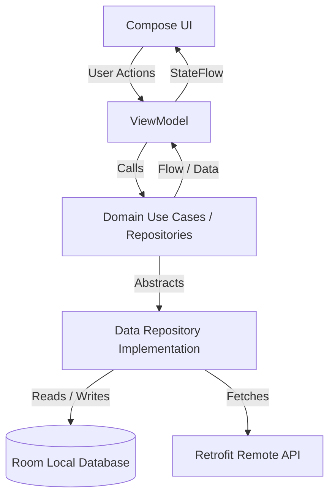
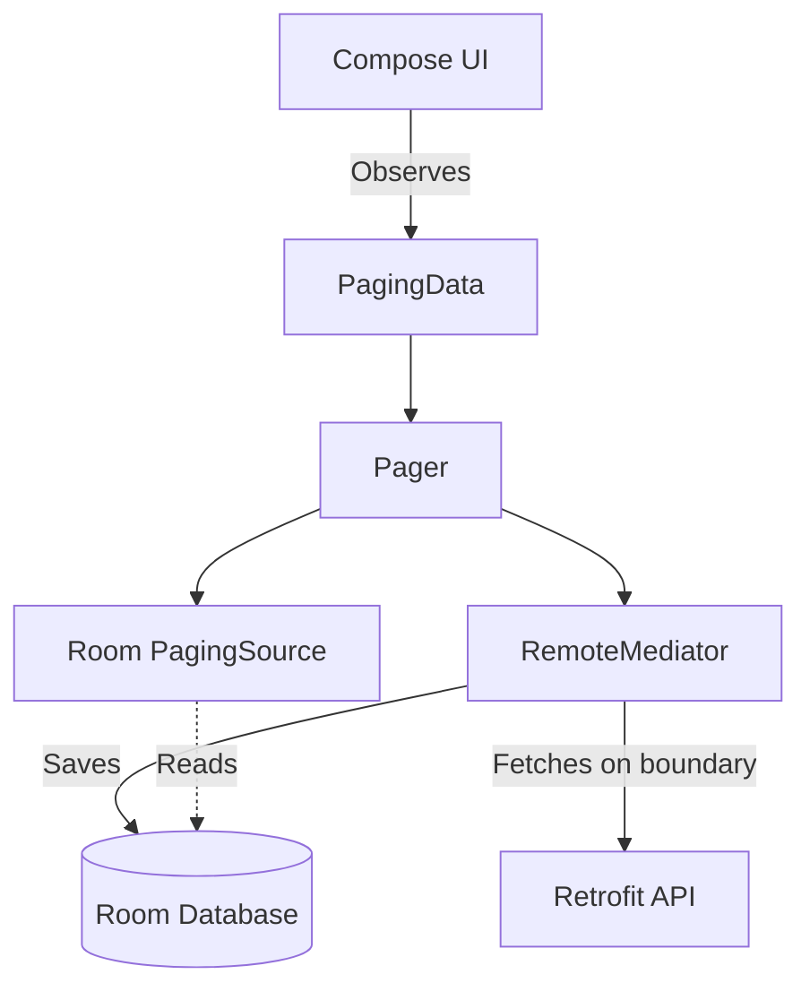

# ShopFlow Architecture

ShopFlow is built on modern Android architecture principles, utilizing Clean Architecture patterns to separate concerns, improve testability, and ensure maintainability.

## Clean Architecture Boundaries

The application is strictly separated into three primary layers:
1. **UI / Presentation Layer**: Displays data to the user and captures user interactions.
2. **Domain Layer**: Contains the core business logic and use cases of the application.
3. **Data Layer**: Manages application data, abstracting the source (local database or remote API) from the rest of the app.

## Data Flow & State Management

ShopFlow employs a unidirectional data flow (UDF) pattern. UI state is exposed via `StateFlow` from the `ViewModel` to the Compose UI.

## Local Source of Truth (Offline-First)

The architecture is designed to be **offline-first**. The Room database acts as the single source of truth for the application.

- The UI always reads data from the Room database.
- The Data layer fetches from the Remote API and saves to the Room database.
- Paging and synchronization are handled transparently to the UI.

## Paging with RemoteMediator

For paginated lists (e.g., the product catalog), ShopFlow uses Paging 3 combined with a `RemoteMediator`.

## Dependency Injection

**Hilt** is used for Dependency Injection throughout the app. It provides a standard way to incorporate Dagger dependency injection into an Android application, managing the lifecycle of dependencies (like Retrofit instances, Room database instances, and ViewModels).

## Core Technologies

- **UI**: Jetpack Compose, Material 3, Navigation Compose, Coil
- **Concurrency**: Kotlin Coroutines & Flow
- **Dependency Injection**: Hilt
- **Local Storage**: Room
- **Networking**: Retrofit, OkHttp, Kotlin Serialization
- **Pagination**: Paging 3
